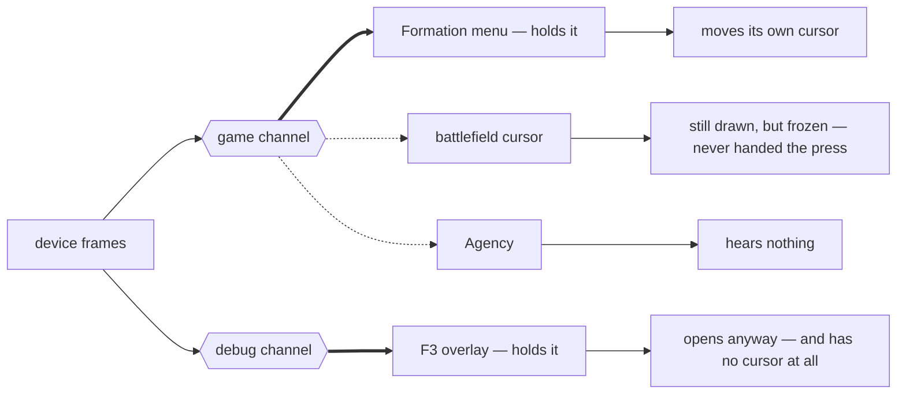
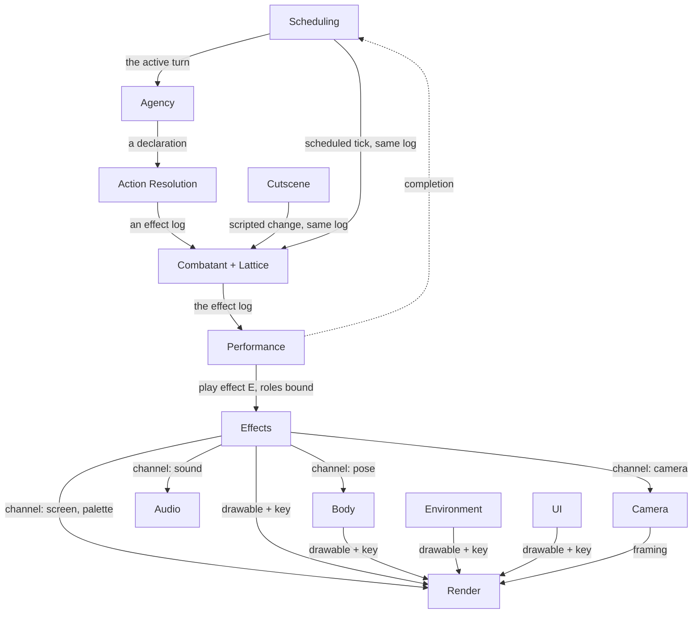
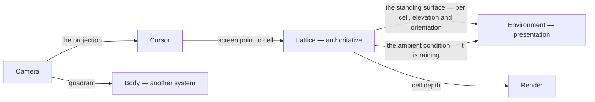
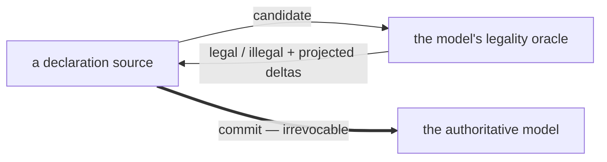

# The blueprint

The **game-agnostic tactics-RPG domain model** — what the systems are, and where
each boundary falls. Authored without reference to FFT or to the current code,
per [ADR-0111](adr/0111-the-research-vault-is-ballast-not-blueprint.md).

**Status: landed.** Recorded as ADRs
[0115](adr/0115-a-system-is-a-bundle-that-ships.md) ·
[0116](adr/0116-a-crossing-needs-a-payload-an-owner-and-an-edge.md) ·
[0117](adr/0117-the-blueprints-ten-systems.md) ·
[0118](adr/0118-payloads-are-schemas-services-are-ports.md) ·
[0119](adr/0119-contested-resources-are-capabilities-not-flags.md) ·
[0120](adr/0120-battle-state-has-one-write-path.md) ·
[0121](adr/0121-systems-land-in-addons-src-only-shrinks.md), with vocabulary in
`CONTEXT.md` -> **The blueprint**. The ADRs are the record; **this page is the
map** — it carries the diagrams and the reasoning, and it is where a change
starts before it is cited.

> **domain model = blueprint · vault = ballast · code = subject**

---

## What a system is

`CONTEXT.md` already defines it, and the definition is the whole test:

> **System**: A unit of extraction — a body of behaviour that could ship to
> another tactics RPG with its interface intact, lifted into one addon.

A system is **a bundle you could ship independently to another game.** The
industry principle behind that is REP — *the granule of reuse is the granule of
release*. If two things always release together, they are one system, however
distinct they are as concepts.

**What fails that test is content** — FFT data, ROM parsers, the wiring that
makes *this* game — and it stays in the host.

**The second test is package versus port, and it has nothing to do with genre.**

> A **port** is a tiny interface whose implementation is trivial and
> assembler-specific — you *write* it. A **system** is a small interface with
> substantial behaviour behind it — you *install* it.

`Render` and `Debug` are both genre-neutral and both systems, because you would
install either rather than write it. Genre-orthogonality is at most weak evidence
that something might be a port.

### An assembler is not a system

An **assembler** is a composition over systems that implements the ports and
wires them together. **The game is one assembler; each authoring tool is
another.** The Effect Studio is not an eleventh system and not host code — it is
a second assembler.

**Amended by [ADR-0134](adr/0134-the-studio-is-an-assembler-and-the-assembler-is-one-file.md)
(2026-08-20):** the clause that used to follow — *"which is why it is 22k lines
and fits neither bucket"* — had it backwards. The **assembler** is
`EffectViewerScene.gd`, **1,321 lines**. The 21,986 lines of
`src/effects/studio/` are not assembly at all; they are `Effects`' authoring
toolkit, placed there by ADR-0115 dec. 3's one-way uselessness test. An assembler
is one file and `O(10^3)` lines; a directory in the assembler list is a defect.

This explains something [ADR-0112](adr/0112-dead-code-is-what-the-root-set-cannot-reach.md)
asserts without justifying: it declares **two root sets** — the ~12 game scenes
*and* the authoring tools. Not a special case for tools. **Each assembler is a
root set.**

**Amended by [ADR-0135](adr/0135-the-root-set-is-eleven-scenes-and-its-assembler-is-the-script-nothing-calls.md)
(2026-08-21).** The pairing is now exact and runs both ways: **a root scene is
one nothing instances, and its assembler is the script nothing calls.** That
second clause is what ADR-0134's shape bound was missing, and it makes the two
lists one declaration — `classify_blueprint.py`'s assembler entries *are* the
root-set declaration, in the only form pass 5 can consume. Ratified: **eleven
roots**, eight game and three authoring (`EffectViewer`, `SequenceViewer`,
`TrapViewer`). `CombatUI` is **struck** — it is an `[ext_resource]` child of
`PlayerCamera.tscn` and fails ADR-0112's own dec. 1.

**Ratified by [ADR-0143](adr/0143-the-root-set-is-ratified-and-the-formation-cluster-is-its-one-exception.md)
(2026-08-21).** Membership is unchanged; the declaration is now
[`docs/ROOT_SET.tsv`](ROOT_SET.tsv) — 31 rows covering every non-test,
non-`tools/` scene, **11 `root` / 15 `declined` / 5 `component`** — guarded by
`tools/check_root_set.py`. Two corrections to the pairing. The disqualifying
relation is **composition**, not instantiation: `Formation` is mounted whole as
an overlay by `NavigatorMain` and freed on dismissal, which is a navigation
transition and evidence *for* roothood. And *"each assembler is a root set"* is
not yet true of the program — `classify_blueprint.py`'s eighteen `assembler`
entries hold **8 of the 11 roots**; `NavigatorMain.gd`, `FormationScene.gd` and
`FormationDetailTransition.gd` are booked into `Campaign` and `UI`, and
rebooking their 7,309 lines is deferred to prologue pass 4's instrument batch.

**A system is not defined by being generic.** `exmateria_sound` ships as an
addon *and* is FFT-specific: the driver ships, the banks are content. What makes
a system is having an interface someone would install against.

### The one-way uselessness test

> **Would anyone use this without that? If no, it is not a separate system.**

The easiest test on this page, and the one that does the most work. It settles
packaging before any risk argument gets a turn, and anyone can apply it —
unlike *"does this crossing fail silently?"*, which requires already knowing the
failure modes.

**Both halves do not have to be useless without each other.** `Battle` without
its presentation is useful; the presentation without `Battle` is nothing. That
asymmetry alone means one system — the dependent half has no release of its own.

What survives on the far side of the test is then a **mode**, not a package:
`Battle` with no bodies attached, `Effects` with nothing subscribed.

**It has already moved two things.** `Deployment` was filed with the durable
records before this test existed; it exists to construct combatants and is
useless without one, so it now sits in `Battle`. The `roster` — the per-side
selection of who is fighting — moved with it. Both moves freed
`Character Catalogue` of every dependency it had.

## The resolution test

The ticket's bar is *"a boundary is resolved only when you can name what crosses
it."* That bar is **insufficient as stated**, and the evidence is in this repo.

[ADR-0020](adr/0020-unit-animation-uses-one-clock-per-unit.md) *did* name what
crossed — "one clock per unit" — and it still failed. Two hosts pumped the same
bodies, every combat body advanced ~2x/frame, and two bugs were patched
separately before the real defect surfaced.
[ADR-0083](adr/0083-a-units-animation-clock-has-exactly-one-owner.md) closed it
by adding the two things ADR-0020 omitted.

| | | ADR-0020 | ADR-0083 |
|---|---|---|---|
| **Payload** | what passes | the animation clock | the animation clock |
| **Owner** | who holds it after | *unstated* | `SELF` / `SCENARIO` / `COMBAT` |
| **Edge** | where it changes hands | *unstated* | `_go_live` |

Two of three is not a boundary. It is a boundary-shaped gap that will be patched
twice before anyone finds it.

### How to find the crossings

Do not wait for inspiration. **For each thing a system owns, list who touches
it and in which direction the dependency runs.** That produces crossings
mechanically, and it is self-checking: any direction running *uphill* — a
system that ships early depending on one that ships late — is a defect that must
resolve either to an inversion or to a change in ship order.

Then pick the **cheapest integration that makes the direction legal**:

| Shape | Cost | Use when |
|---|---|---|
| **Query** | free — typed and greppable | the consumer is above the owner and just needs an answer |
| **Command** | free | the consumer is above the owner and changes state |
| **Capability** | small | exactly one holder at a time |
| **Event / subscribe** | **loses the call graph** | the call would run *uphill* and must be inverted |
| **Published language** | a schema to version | many consumers, and the owner must not know any of them |

**Events are the expensive shape and should be rare.** They buy a dependency
inversion and cost the ability to grep for who handles something. Publishing
everything trades obscurity for decoupling nobody needed.

Two worked cases, deliberately contrasting:

- **The gambit list**, owned by `Character Catalogue`. `Agency` reads it — downhill, a query.
  UI edits it — downhill, a command. The catalogue needs to know nothing about
  either. **No events.**
- **Effect channels**, owned by `Effects`. It must cause sound, camera moves and
  poses — but it ships first and may depend on nothing. **Uphill, so invert:**
  events over a published language.

That is the whole reason `Effects` uses subscription and the catalogue does not. The
shape follows from the direction, never from taste.

### Where a crossing is allowed to live

**A crossing that fails by silent disagreement belongs inside one system. A
crossing that fails visibly may span two.**

This is the rule that decides packaging, and it overrides tidiness. Picking a
cell with a different projection than the one used to render it puts the cursor
on the wrong tile, subtly, only at some heights and angles — so camera, cursor
and lattice ship together. Drawing a body facing the wrong way is about as
visible as a bug gets — so the camera's quadrant can be read across a seam.

---

## The eleven systems

### 1 · Battlefield — the place, how you see it, how you point at it

| Part | Owns |
|---|---|
| `Lattice` | the discrete standable space — elevation, orientation, surface properties, multi-level cells, ambient conditions |
| `Environment` | map geometry, the far-field gradient, ambient weather, lighting |
| `Camera` | orthographic projection, fixed angles; publishes its quadrant |
| `Cursor` | a cell pointer, and screen-to-cell picking |

**Crosses out:** reachability, targetability and occupancy answers · the
standing surface · the camera quadrant · the cell under the pointer.
**Crosses in:** a traversal profile · camera claims.
**Content shadow:** FFT map files, and the importer whose job is to assert the
lattice and the mesh agree.

> **Amended 2026-08-23 by ADR-0157 (extraction #3, loop pass 1 — ADR-0126 check 2
> read early, as a selection input): three of the six crossings above do not
> exist as typed reaches, and the one outbound edge that does runs against the
> table.** Measured at `126dfec9b`: *reachability/targetability/occupancy* is
> present (`Tile`, 72 lines, all from `Battle`); *the standing surface* is present
> (`TerrainIndex`, 20); *the cell under the pointer* is present (`TileCursor`, 3 from `UI` and 1 from the assembler).
> **`the camera quadrant`, `a traversal profile` and `camera claims` are ZERO** —
> `src/scenes/PlayerCamera.gd`, 788 lines and the system's largest file, has no
> cross-system typed edge in either direction; its only outbound is the `Tune`
> port. And `src/map/Tile.gd` carries `reserved_by: Unit` plus `is_blocked`,
> `try_reserve` and `release`, all typed to `Battle`'s `Unit`: the lattice
> **stores** the combatant and owns the reservation protocol, where the row above
> has occupancy crossing *out* — answered from a profile that is not there. This
> is the fourth blueprint sentence to fail on first contact. **Recorded, not
> rewritten** (ADR-0126 check 2) — treat the three zeroed crossings as
> hypotheses with a named falsifier, not as fact, and do not cite them while the
> fix is pending.
>
> > **Amended 2026-08-27 by [ADR-0166](adr/0166-occupancy-is-battles-in-five-spellings-and-battlefields-sixth-is-inert.md)
> > dec. 2, built at [#642](https://github.com/timbermania/fft-monorepo/issues/642): the
> > occupancy half of the paragraph above is discharged, and the row was right.** The
> > lattice no longer stores the combatant and owns no reservation protocol —
> > `reserved_by`, `is_blocked`, `try_reserve`, `release` and `became_available` are
> > deleted from `addons/exmateria_battlefield/lattice/Tile.gd`, and goal #5 arm 1 reads
> > **0** for the addon. The measurement stands as taken; what changed is the code.
> > Occupancy does **not** cross out as the row says either: ADR-0166 dec. 1 measured six
> > spellings of the concept and five are `Battle`'s, so `Battlefield` now holds none of
> > it. `the camera quadrant`, `a traversal profile` and `camera claims` are untouched and
> > remain hypotheses.

### 2 · Battle — simulate a tactical battle, and show it

| Part | Owns |
|---|---|
| `Combatant` | volatile per-body state — health, statuses, facing, its cell claim |
| `Scheduling` | turn order, the active turn, reaction windows |
| `Action Resolution` | declaration to effect log. **Stateless** |
| `Agency` | declaration sources — player intent and AI intent; the *selection* |
| `Performance` | the effect log to a schedule; which effect plays for which action |
| `Body` | the binding of a combatant to a rig — pose from unit state, holding the pump, forwarding the pose channel |
| the `roster` | the per-side selection of who is fighting this battle |
| `Deployment` | turning character records into combatants, and placing them within a declared zone |

**Crosses out:** the outcome ledger · pose requests · play requests to `Effects`
with roles bound · the effect log, observable for replay and save.
**Crosses in:** character records · a battle setup, including the placement zone
· lattice answers · an explicit randomness source · `Effects`' pose channel,
which **`Body` subscribes to, never the rig**.
**Content shadow:** FFT ability and formula data, its CT clock rules, the
ability-to-effect table, the state-to-animation table, the deployment-zone
records.

#### Why the simulation and its presentation are one system

**Nobody would use the presentation without the simulation.** That settles it on
its own, before any risk argument gets a turn: a thing with no independent use
is not a separate release, and REP says the granule of reuse is the granule of
release.

**The asymmetry is the tell, and one-way uselessness is enough.** `Battle`
without presentation is genuinely useful — headless simulation, the GPU arena,
tests, AI training. Presentation without `Battle` is nothing. Both halves do not
have to be useless without each other; the dependent half simply has no release
of its own. So *"battle without presentation"* is a **mode**, not a separate
package — the same shape as importing `Effects` with nothing subscribed to its
sound channel.

**And the risk argument agrees, secondarily.** The seam between them is an
agreement crossing: if the presenting side's idea of a combatant's position
diverges from the authoritative side's, nothing errors — the sprite is simply in
the wrong place. The missing melee hit-cloud in ADR-0083's context is the same
failure, presentation inferring *a hit had landed* from a state flag and losing
the race. Nothing forces two packages to move together.

**It also makes the hardest implementation question internal.** An event log
wants order; a GPU simulator naturally produces *state*, computed in parallel,
where cross-workgroup ordering is not free. Whether the authoritative side emits
an append buffer, or the presenting side diffs state between ticks, or a hybrid
emits a small set of notable events — *hit landed, unit died, spell cast* —
beside the state sync, is now a decision this system owns rather than a contract
negotiated across a package boundary. **The hybrid is the recommended shape:**
state stays the sync path, and the events presentation actually needs stop being
inferred.

**One cost, and its fix.** `Body` issues pose requests, which would drag sprite
rendering into a headless import. So **pose requests are a published schema**:
`Body` emits, `Sprite Rig` consumes, `Battle` depends on the schema and never on
the renderer.

> ⚠️ **False today — audited 2026-08-31 by extraction #4 loop pass 2
> ([ADR-0214](adr/0214-sprite-rigs-scope-is-anchored-and-its-pass-1-numbers-were-taken-through-a-keyhole.md)).**
> This is a statement of the target, not of the tree, and the tree disagrees by a
> wide margin. `Battle` reaches `Sprite Rig` on **91 code lines across 10 files** —
> the largest inbound bucket the system has — and `assets/scenes/Unit.tscn`, whose
> root script is booked `Battle`, names **four** `Sprite Rig` files by
> `ext_resource`. The schema indirection is the design; nothing has built it yet.
> Recorded rather than rewritten: the fix is extraction #4's whole point.

### 3 · Character Catalogue — what you have

| Part | Owns |
|---|---|
| `Character` | the durable, slug-keyed record every unit is — identity, job, equipment, learned abilities, gambits |
| `Holdings` | what the party owns collectively — money and the item pool |

**Crosses out:** **character records**, as a published schema.
**Crosses in:** the outcome ledger, applied only at battle end.
**Content shadow:** FFT job tables, stat growth, item data.

**`Character Catalogue` depends on nothing.** It is the master identity layer —
one durable record per unit, referenced and never copied (ADR-0005), and
`CONTEXT.md` already calls it *"the master identity layer above the battle
roster… the registry that owns them all."* ADR-0066 promoted it over
`UnitRosterData` for exactly this reason.

**The *roster* is not a system.** `CONTEXT.md` defines it as *"the per-side
collection that owns them across battles"* — a **selection** over the catalogue,
scoped to one battle. Selections live where they are used, so it sits in
`Battle` beside `Deployment`, which consumes it.

**Holdings belong here, not on the spine.** Equipping is a *transfer*: remove
from the pool, attach to a character. Buying is money out, item in. Split those
ends across two systems and an item can be lost or duplicated in between, and it
fails silently. The transactions must be atomic, so both ends live in one
system.

### 4 · Sprite Rig — posing a composite character

**It does not know what a combatant is.** Give it a pose, a facing, a camera
quadrant and an equipment set, and it draws. It never asks about health, turns
or abilities — which is exactly why it is pluckable.

> ⚠️ **FALSIFIED 2026-08-31 — extraction #4 loop pass 2, ADR-0126 check 2**
> ([ADR-0214](adr/0214-sprite-rigs-scope-is-anchored-and-its-pass-1-numbers-were-taken-through-a-keyhole.md)).
> Recorded rather than rewritten, per the `BLUEPRINT-AUDIT.md` precedent, so
> nobody cites it while the fix is pending. This is the claim ADR-0126's
> Consequences flagged as *"the same untested 'knows nothing about combatants'
> claim that turned out false for `Effects`"*. It turned out false again.
>
> **"It does not know what a combatant is" — FALSE.** `src/animation/UnitDisplay.gd`
> declares `var _unit: Unit` and reaches the combatant type on **three** code lines
> (34, 107, 366) and `ReactionType` on **three** more (663, 690, 736), both booked
> `Battle`. Not a comment, not a duck-type: a typed field on the class that drives
> the rig.
>
> **"It never asks about … abilities" — FALSE.**
> `src/animation/AnimationResolutionMap.gd:377` calls
> `AbilityDatabase.get_ability_view(ability_id)`. This one is worth a second
> sentence, because it is *why* the claim survived pass 1: `AbilityDatabase` is
> booked **`generated`**, and `touch_matrix.py` prints a SYSTEM × SYSTEM matrix, so
> a reach into a non-system bucket is structurally invisible to the reading ADR-0213
> made. The edge was in the tool's own cache the whole time.
>
> **"It never asks about health" — FALSE.** `IDLE_LOW_HEALTH` is a member of this
> system's own generated `DisplayActivity.Activity`, resolved by name in
> `AnimationResolutionMap` (126, 144-145, 209) and forced by
> `AnimationStateController.to_critical_idle` (203, 215). The system does not
> read an HP value — the caller does — but it holds a first-class notion of *being
> nearly dead*, and `ReactionType` above is a combat concept by any reading.
>
> **"It never asks about … turns" — HOLDS.** Zero hits across all 29 files. One of
> the three survives.
>
> There is more in the same direction: `WeaponZeroFrames` (3 lines),
> `JobDatabase` (2) and `WeaponGraphicData` (1), all booked `content`. The honest
> restatement is narrower and still worth having — **it does not know what a
> combatant is *doing*.** It knows what one *is*. The fix is a pass-3 seam
> question, not a wording edit, which is why the sentence above stands unchanged.

| Part | Owns |
|---|---|
| templates | which parts compose a character type |
| shapes | frame assembly from sheet regions |
| sequences | animation timelines |
| draw order | how parts stack |
| attachment | weapons, swooshes, effect sprites bound to points on the rig |
| modulation | per-pixel operations on a composed sprite |

**Crosses in:** a pose request on the published schema — pose, facing, quadrant,
equipment set, attachments — and a position.
**Crosses out:** drawables with a compositing key.
**Content shadow:** SEQ/SHP data and FFT's animation sets.

> **Amended 2026-08-26 by [ADR-0189](adr/0189-the-unit-sprite-is-a-module-and-a-consumer-asks-for-a-variant.md).
> The `modulation` row is new, and it is new because a real effect belonged to
> neither system's Parts as written.**
>
> The Change-Job commit dissolve — a cell-noise conceal plus a bilinear gouraud
> corner tint on a unit's own sprite — is not a pose, a facing, a quadrant, an
> equipment set or a position, so the crossing above does not reach it; and §6
> gives `UI` *"the open and close cadence"* and *"preview + commit"*, under which
> it reads as `UI`'s. It is booked here on **ordering**: the tint must modulate
> between the colour-stack fold and the ambient term — where the PSX applies
> gouraud — and only the system that owns that pipeline can guarantee the
> position. `UI` owns *when* the commit runs and with what corners.
>
> The same ADR closes the hole that let `UI` and `Cutscene` fork this system's
> compositor: **`Sprite Rig` publishes a variant** (`OPAQUE | ADDITIVE | FLAT`),
> and no file outside it names a unit shader path. `Crosses in` gains a variant
> request beside the pose request; `Crosses out` is unchanged.
>
> > ⚠️ **The last clause overstates its own guard — audited 2026-08-31, ADR-0214.**
> > `tools/check_unit_shader_paths.py` enforces *"no **`.gd`** outside `Sprite Rig`
> > names a unit shader path"*, and it enforces it correctly. **"No file"** is
> > wider than that and is false: `assets/scenes/Unit.tscn:5` (booked `Battle`),
> > `assets/scenes/SequenceViewer.tscn:4` (`assembler`) and
> > `assets/materials/unit.tres:3` all bind `assets/shaders/unit.gdshader` by path,
> > and five `tools/*.py` name the variants as data. The guard is not weakened by
> > this — a `.tscn` cannot fork the compositor, which is the disease ADR-0189
> > treated. The blueprint sentence is what needs the narrower word, and the
> > `.tscn` bindings need counting before pass 4 moves the shaders.

**Genre-orthogonal, like `Render`.** Multi-part directional sprite
characters with quadrant-dependent frames is *isometric sprite work*, not
tactics. An ARPG, a builder or a beat-em-up would want it whole.

### 5 · Effects — the effect timeline player

**The most pluckable thing on this list, and the reason it ships alone.** It is
glued to sound, camera and unit poses in every game that has one — so the glue
is inverted rather than cut.

| Part | Owns |
|---|---|
| the timeline | a multi-channel script of events over time |
| the particle simulation | emitters, motion, lifetime |
| the channel vocabulary | the **published language** every consumer implements |

**It depends on nothing.** It emits; consumers subscribe. With no `Audio`, no
`Camera` and no `Body` installed, the events go unheard and the particles still
play.

> **Half true — audited by [#315](https://github.com/timbermania/fft-monorepo/issues/315)**
> ([ADR-0127](adr/0127-effects-publishes-and-requires-two-ports.md)). The
> pluckability thesis survives; *"depends on nothing"* does not. `Effects`
> **publishes and requires two ports — clock and anchor.** ADR-0118 dec. 3's test
> (*does the caller need an answer?*) makes camera, sound, screen, palette and
> landmark all publishes, not ports, so the outward direction is right in
> principle. It is unfinished in practice: **one lane of ten actually
> subscribes.** `landmark` uses signals; five lanes reach their listener by a
> hardcoded autoload name (`ScreenEffectOverlay`, `MapTintOverlay`,
> `UnitTintOverlay`, `ExMateriaEffectSfx`); `camera` does not publish at all — the
> assembler polls `current_angles` / `current_position` / `current_zoom` and
> writes them back each frame. A global name cannot be a crossing, because an
> addon cannot ship `project.godot` entries. The gap is wiring, not architecture,
> which is why a **second assembler already substitutes two of them** — the
> Effect Studio parks the clock and drives `seek(frame)`, and supplies no unit
> tint at all.
>
> **Falsified again, with numbers — extraction #7's pass 3**
> ([ADR-0288](adr/0288-the-sixty-one-debug-lines-are-four-booleans-and-the-seam-is-three-addresses-once-the-psx-trio-goes-home.md)
> dec. 3, recorded here by [ADR-0290](adr/0290-an-addon-was-never-a-system-and-the-arm-4b-blocker-is-four-throwaway-probe-shaders.md)
> dec. 9 under [ADR-0126](adr/0126-every-system-pass-audits-before-it-designs.md) check 2).
> #315 tested *pluckability*; this is the same sentence measured against the 67-file
> extraction membership by `tools/membership_arms.py`: **arm 1 = 67, arm 2 = 72, arm 5 = 63,
> arm 7 = 3.** The sentence **stays in this file with this note** rather than being
> rewritten, and it is expected to become true at pass 6 — ADR-0288's prediction is arm 1
> → 3, arm 2 → 0, arm 7 → 0. ⚠️ Re-read then, not before; a rewrite now would delete the
> only record that the slogan was ever wrong.

**Crosses in:** a **role binding** — caster, target, cell mapped to anchors. An
anchor answers position and orientation and nothing else, so it is satisfiable
by a body, a cell, or a test double. *The effect never learns what a combatant
is.*

> **False today — [#315](https://github.com/timbermania/fft-monorepo/issues/315).**
> The role binding resolves roles to anchors for **position** (`EffectInstance`
> sets `caster_position` / `target_position` / `cursor_position`), but the
> **palette lane bypasses it**: `PaletteSubsystem` holds `WeakRef`s to caster and
> target **`Unit` nodes** and calls `get_instance_id()` to key the tint. This is
> the blueprint's strongest claim about `Effects` and it does not hold. Recorded
> rather than rewritten, per the `BLUEPRINT-AUDIT.md` precedent; the fix is
> undecided, but it likely follows the same idea — a role should resolve to a
> *tintable surface handle* exactly as it resolves to an anchor.
>
> **Widened by the #315 audit (ADR-0127):** the leak is in **two** lanes, not
> one. `CameraSubsystem` also holds `caster_unit` / `target_unit` /
> `cursor_unit` plus a `facing_resolver`, keying a yaw cache on
> `get_instance_id()`. The same role-resolves-to-a-handle fix covers both. The
> tint half of that seam is already half-built under another name —
> `DynamicGeometryBuilder.register_material`, `Unit.register_unit` and
> `MapComposer.set_default_gradient` are three adapters enrolling their surface,
> which by the two-adapters test is a real seam rather than a hypothetical one.
>
> **Re-read at extraction #7's pass 3 and the verdict INVERTS: behaviourally TRUE,
> syntactically false on three annotations** (ADR-0288 dec. 3, recorded by ADR-0290 dec. 9).
> #315 cited `PaletteSubsystem`'s `WeakRef` + `get_instance_id()` as a coupling a scan
> cannot see. At `e1d58ab6d` it is the opposite: `get_instance_id()` is **`Object`'s**, the
> `WeakRef` is held so a freed node is not kept alive, and **nothing `Unit`-shaped is ever
> asked for**. Every use the runtime makes of a caster or a target is `global_position`,
> `add_child`, `get_instance_id()`, `is_instance_valid()` and `.name` in a `print` — which
> is this paragraph's own anchor definition. `attach_anchors_to_units(caster: Node3D,
> target: Node3D)` is already typed that way, and `UnitTintOverlay` never dereferences the
> id it is keyed by (`src/units/Unit.gd:730` calls it *with* the material).
>
> **The whole remaining defect is three type annotations the scan CAN see** —
> `caster: Unit, target: Unit` at `src/effects/EffectManager.gd:48`, `:132`, `:258`; a
> fourth entry point, `spawn_trap_effect` at `:206`, takes its target untyped. Six further
> `Unit` mentions in the membership are **prose** — `EffectInstance.gd:841-842`,
> `CameraSubsystem.gd:147`, `UnitTintOverlay.gd:15/35/49` — which score on no arm and are
> the addon's own docstrings teaching the coupling this paragraph says does not exist.
**Crosses out:** channel events on the published schema, plus its own drawables
with a compositing key.
**Content shadow:** `E###.BIN` scripts and textures.

#### What makes this hold together

**Published Language + Open Host Service.** `Effects` declares the **lanes** and
an event shape per lane. Declaring *"there is a sound lane with these fields"* is
not a dependency on `Audio`; it is a contract anyone can satisfy.

> **Corrected by #307** ([ADR-0122](adr/0122-an-effect-lane-is-a-track-of-non-overlapping-typed-events.md)).
> The predicted six were `sound`, `camera`, `pose`, `screen`, `palette`,
> `landmark`. Measured against `src/effects/`: **there is no `pose` channel** —
> `CombatLoop._on_ability_react` picks the SEQ id from `AbilityDatabase`, so the
> effect supplies the moment and the consumer picks the pose. And `camera`,
> `screen` and `palette` are each several lanes stored in one slot. The real list
> is `particle` · `camera.angle` · `camera.position` · `camera.zoom` · `screen`
> (`gradient` + `blend`) · `palette.affected_units` · `palette.caster` ·
> `palette.target` · `sound` · `landmark`. A lane is a track of events that do
> not overlap; **extent and payload kind are declared per event, not per lane**.

**Roles, not references.** The decoupling is not in the events, it is in the
binding. A script that could hold a `Unit` reference would drag `Body` with it
forever.

**Events must be typed, and spans must be spans.** The failure mode of pub/sub
is the contract dissolving into dictionaries with string keys, at which point
every consumer guesses and a direct call would have been better. The channel
schema *is* the interface — one declared file, versioned. And "hold pose 5" has
duration, so events that have extent must say so, or every consumer invents its
own way to end things.

**Landmarks are just a lane** whose events are named moments rather than
instructions. This removes a concept rather than adding one.

> **Sharpened by #307** ([ADR-0123](adr/0123-the-landmark-lane.md)). Right about
> *addressing*, wrong about *extent*: `reaction` is a **span** the ROM writes as
> two triggers (`ABILITY_REACT` opens, `REFRESH_TILE` closes — 290 of 411
> effect-contexts pair them, inverted in none), and `hit` is a trigger. The lane
> also turns out to be the **same kind of thing as `sound`**: an opaque code at a
> frame, resolved by whoever listens. Give it the per-effect event table `sound`
> already has and it becomes `Effects`' one extension point — which is what makes
> the rest of the lane list safe to fix.

**The cost, stated plainly:** the call graph goes invisible. You cannot grep for
who handles `camera.shake`. That tax is paid daily by whoever works on effects,
and the channel schema file is the only mitigation — the vocabulary stays
enumerable even when the handlers do not.

### 6 · UI — menus and screens

| Part | Owns |
|---|---|
| the toolkit | windows, panels, fonts, lists, focus movement, the open and close cadence |
| preview + commit | a candidate scored by a legality oracle the model owns, then an irrevocable commit |

**Content shadow:** Formation, Equip, Learn, Unit Detail, the battle HUD — the
actual screens are compositions, and they stay.

### 7 · Audio

| Part | Owns |
|---|---|
| the sound driver | cues to sound |

Already shipping as `exmateria_sound`, which references zero of the host's
autoloads (24 at the time; 26 today). **The closest system to finished** —
`Effects`' calibration benchmark, and not the same thing as extracted.
Subscribes to `Effects`' sound channel.
**Content shadow:** one instrument bank (`WAVESET.WD`) and **four bank
families** — 100 SMD songs, 2 global `feds` banks, 401 per-effect `feds` banks.

> **Amended 2026-08-21 by [ADR-0136](adr/0136-audio-is-one-opcode-language-in-two-containers.md)
> dec. 5.** The zero-autoload reading is correct and measures the wrong
> direction: `Audio` **is** four of the host's 26 autoloads (`ExMateriaAudioEngine`,
> `MusicPlayer`, `ExMateriaEffectSfx`, `SfxRouter`), reached from 79 sites in 21
> host `src/` files, and `EffectSfxEngine.gd` is **1,261 lines of driver** still
> in the host. The finished system is 15,953 addon lines *plus* that driver. Its
> extraction pass is a **driver split**, not cheap validation. Dec. 1 also
> replaces "three sequence formats" everywhere: **two containers, one opcode
> language.**

> **Amended 2026-08-22 by ADR-0153 (extraction #2, loop pass 3) — the
> *Subscribes to `Effects`' sound channel* line above is FALSE, and the arrow
> points the other way.** Measured at `78ab1fcd6`: `Audio` -> `Effects` is
> **zero lines**; `Effects` -> `Audio` is 24, of which eleven are
> `EffectInstance.gd` calling the driver imperatively (`begin_effect`,
> `play_pair`, `end_effect`, `orphan_effect`). `Audio` subscribes to nothing.
> The one signal in the picture, `pair_triggered`, is emitted by an **addon**
> object that `Effects` owns and subscribes to itself. Recorded rather than
> rewritten, per ADR-0126 check 2 — retiring the call is `Effects`' pass, via
> ADR-0124's channel and ADR-0127's two ports, not `Audio`'s.

### 8 · Cutscene — the script player

| Part | Owns |
|---|---|
| the interpreter | an ordered program of instructions, with waits and branches |
| staging | placing and moving bodies, framing the camera, showing text |

**The whole boundary is one rule: it has no private door.** Every scripted
command goes through the interface any other caller uses. Scripted damage is an
effect-log entry with `cause = script`. A scripted camera move is a camera
claim. It owns **no mechanism of its own** — it is a sequencer over other
systems' public interfaces.

ADR-0111 records that `ScenarioVM.gd` is 4,383 lines of which the 60 opcode
handlers are only 925. Machinery accretes in a script host precisely when the
host has private doors.

**It does not need `Battle`.** A cutscene poses sprites, walks them around and
shows text — `Sprite Rig`, `Battlefield`, `UI`, `Character Catalogue`,
`Effects`, `Audio`, `Render`, all wave 1. It hands *off* to a battle rather
than requiring one, and even its mid-battle triggers are a **subscription to the
effect log schema**, not a call into `Battle`.

**A `Scenario` is not this system — it is a record this system is pointed at
by.** [ADR-0029](adr/0029-encounter-setup-is-a-scenario-not-an-event.md) settles
it: a `Scenario` is a 24-byte join row (map, songs, deployment, weather,
story-flow links, and an `event_script_id` **pointer**) — content, consumed by
`Campaign` and `Battle`. Three layers, three words: **`Campaign` picks a
`Scenario`, which points at an event script, which `Cutscene` plays.**

*The name avoids two collisions on purpose.* ADR-0029 reserves **"event"** for
two existing meanings, which is why the repo always qualifies it. And **"scene"**
is the most overloaded word in a Godot project — `.tscn`, `res://scenes/`, and
ADR-0112's entire root-set analysis.

**Content shadow:** FFT event scripts and the ROM opcode decode.

### 9 · Campaign — the spine

**Where you are, and what comes next.** Story scene, formation, deployment,
battle, results, world map. Nothing else in the model owned the meta-loop:
`Cutscene` plays one scripted scene, but nothing owned *"after this
battle, go to results, then the map."*

| Part | Owns |
|---|---|
| the mode | which of the game's modes is active, and the transitions between them |
| progression | story position, world flags, which scenarios are unlocked |

**Crosses out:** a scenario identity to run · mode transitions.
**Crosses in:** a scenario result.
**Content shadow:** FFT's chapter structure, which scene follows which.

**The flags belong here, not in `Cutscene`.** The spine is what *gates
transitions* on them; a scenario merely reads one. And the split against the
catalogue is clean: **the catalogue owns what you have, the spine owns where you
are.** No overlap, and each one's transactions stay internal.

**The weakest system on the list.** The *sequence* is content, and a mode stack
with transitions is close to generic. Its case rests on the tactics meta-loop —
formation, deployment, battle, results — being genre-shaped rather than
universal. Defensible, but it is the same shape as `Battle Presentation`, which
did not survive.

### 10 · Render — the retro look

| Part | Owns |
|---|---|
| `Compositor` | the layer stack and the ordering rule |
| the depth model | ordering-table / `CUSTOM0` depth |
| colour modes | the blend shaders |
| shader templating | the generic `.gdshaderinc` library producers `#include` |
| the fold | pre-transparent compositing |
| display | pixel aspect |

**Crosses in:** a drawable, its **material**, and an **order key** — via
`Fold.add`, the sole sanctioned entry
([ADR-0129](adr/0129-the-fold-is-renders-and-a-producer-keeps-its-shader.md)).
Nothing that draws chooses its own place in the final image; *place* is order,
and order is surrendered on both submission paths. A producer does keep its own
**shader**, taking `Render`'s library for the generic parts — which is where
`anchor space` and, on the direct path, colour mode actually live. **Five systems
produce into the fold** — `Effects`, `Battlefield`, `Sprite Rig`, `UI` and
`Render` itself.

> **Amended 2026-08-21 by [ADR-0147](adr/0147-renders-seam-is-the-fold-bracket-and-one-port.md)
> (extraction #1's scope pass). Three of the rows above and two sentences here no
> longer describe the code, and none of it changed because of the extraction.**
>
> - **`Fold.add` is the KERNEL's**, not `Render`'s — ADR-0146 moved `Fold`,
>   `DepthMode`, `ColorStack` and `ColorRecipe` into
>   `addons/exmateria_schema/`. Producers and `Render`'s own bracket encode
>   against the same published key; neither invokes the other. `Render`
>   publishes **one** thing, the `PSXDisplay` port, which carries **26 of its 27
>   inbound system lines**. *(Built: the port carries 26 of **28**, and the
>   addon publishes **two** symbols — moving `EngineFoldCompositor` to `Effects`
>   gave `FoldSurface` its first inbound edge. ADR-0148 dec. 6.)*
> - **The *shader templating* row is empty.** All five named library entries are
>   booked elsewhere: `ot_depth` and `color_stack` are the kernel's, `par` and
>   `dither` are `platform`'s (ADR-0146 dec. 4 — a fact six buckets `#include`
>   cannot live inside the first system to extract), `screen_blend` is
>   `Cutscene`'s. `Render` owns nine concrete shaders and no includes.
> - **Four systems produce into the fold, not five, and `Render` is not one of
>   them.** Of the sixteen shaders that declare `compositor_layer`: `UI` 7,
>   `Battlefield` 4, `Effects` 4, `Sprite Rig` 1, **`Render` 0**. The fifth was
>   `effect_fold_{add,sub,mix}` being booked `Render`, which ADR-0200 dec. 11
>   reassigned to `Effects`. The system that owns the bracket is not a producer
>   into it.
>
> What `Render` extracts as is **the fold bracket plus the display port** —
> 7 files / 701 lines.

**This system is genre-orthogonal.** It is not about tactics at all; it is about
looking like a PlayStation. A brawler or a racing game going for that look would
want exactly this and none of the rest. The shaders and the depth model *are*
the deliverable.

**Three systems form the stranger's pull.** `Render` + `Effects` +
`Sprite Rig` is a **retro isometric sprite toolkit** with no tactics RPG in it
anywhere. They are the three with almost no content shadow, they depend on
nothing, and they are what someone would actually plunder from this project.

> ⚠️ **Two of the three clauses are false for `Sprite Rig` — audited 2026-08-31,
> ADR-0214.** *"No tactics RPG in it anywhere"* fails on the same evidence as §4
> above: `Unit`, `ReactionType`, `AbilityDatabase`, `JobDatabase`,
> `WeaponZeroFrames`, `WeaponGraphicData`. *"Almost no content shadow"* fails on
> the path register: **17 of this system's 22 outbound `res://` references point
> at `assets/`** — sprite sheets, palettes, an EVTCHR frame index, three JSON
> tables and `map.tres` — hard-coded in nine files
> ([`EXTRACTION-4-PATH-REFERENCES.md`](EXTRACTION-4-PATH-REFERENCES.md)). The
> content shadow is the *largest* single thing a move has to relocate, and it is
> invisible to `touch_matrix.py` because a path is not a typed symbol.
> *"They depend on nothing"* is the third and it is untested here.

**It also inverts goal #8.** "PSX compromises divorced, each recorded as a known
drop" assumes PSX-ness is something to shed. Here it is the product. In this one
system a known drop is a regression, not progress.

### 11 · Debug — the panel host

| Part | Owns |
|---|---|
| the panel host | full-screen panels in their own window (ADR-0035) |
| field widgets | the editors a declared tunable renders as |
| the override layer | ADR-0068's coalescing defaults |
| the declaration walk | discovering what loaded systems declare |

**Systems declare their tunables; `Debug` discovers and renders them.**
[ADR-0113](adr/0113-tunables-invert-at-the-addon-boundary.md) already inverts the
arrow — *"the addon declares its own tunable schema through its own interface;
the dashboard walks the loaded addons and renders whatever they declare."* This
makes the dashboard **a system rather than the host's**, and the tunable
declaration the **sixth published schema**. Neither side knows the other.

**Panels that know what a gambit slot means ship with their system.** The host,
the widgets, the override layer and the discovery walk are `Debug`.

*(2026-08-21, [ADR-0140](adr/0140-debug-is-a-system-and-a-system-logs-itself.md):
this was right and the instrument could not execute it. A stale `"DebugPanel"`
entry in `classify_blueprint.py`'s `DEBUG_HOST`, matched as a substring, held **30
per-system panels / 4,027 lines** inside `Debug`, which therefore read 45 files /
6,911 lines against a true **15 / 2,884**. Corrected, `Debug`'s outbound edges
into systems are **0** — a pure sink, so extraction order stays free. Its inbound
is **160**, not 88: `TuneField` 58, `DebugConfig` 57, `BaseDebugPanel` 37,
`GameLogger` 4, `DebugOverlay` 4. Also: **the declaration is the seventh
published schema, not the sixth** — ADR-0139 dec. 14.)*

**Genre-neutral and still a system**, by the port-versus-package rule: a small
interface with substantial behaviour behind it, which you install rather than
write. Same standing as `Render`.

**Crosses in:** tunable declarations.
**Content shadow:** the panels that know FFT concepts — those stay with their
systems.

**This is the highest-leverage portability change in the package.** ADR-0113
measured `DebugConfig` at **69 of 321 `src/` files** — more than one file in
five. *(2026-08-21: and the **target** was wrong — of 324
references, **73% are verbosity gates**, 15% launch control, 12% tunables. **A
system logs itself**; there is no inter-system logging and `GameLogger` is
deleted rather than promoted. ADR-0140 dec. 4-6.)* A system that reads it cannot ship without dragging the debug harness
along, which is goal #5 failing while appearing to pass. *(That denominator is the **2026-07-12** census — see
[ADR-0131](adr/0131-the-progress-bar-is-two-counts-per-system-lines-and-uninterfaced-reaches.md).
Against today's 470 `src/` files the share is at most **one in seven**, and a
re-measure with comments and string literals stripped gives 61, or one in eight.
The leverage claim stands — `DebugConfig` is still the most-touched autoload in
the package by a wide margin — but it is not one file in five.)*

---

## Not systems

### Generic subdomains — infrastructure, not systems

`Clock` · `Focus` · `Definitions` · `Residency` · `Persistence`

A tick source, a focus arbiter, a definition resolver, an asset cache, a save
serializer. None is about this genre, so none earns a system slot. Their common
shape — *own a resource, partition it into named lanes, mint one exclusive
handle per lane* — is a keyed registry with leases. **That is a data structure,
not a domain finding**, and mistaking one for the other is the failure this
section exists to record.

**Being infrastructure does not mean the code does not exist.** Evans' advice
for a generic subdomain is *do not invest your best people here* — an investment
level, not a purchase order. Most of these are built in this repo, and one of
them is load-bearing:

| Member | Reality |
|---|---|
| **Clock** | **Built.** Godot supplies frame callbacks; the vblank-quantized tick (ADR-0065), named rates, the batched multi-tick, and pump ownership (ADR-0083) are ours |
| **Focus** | **Mostly built.** `InputMap` and `InputEvent` are Godot's; channel partitioning and focus handles are ours — the *open screen owns the whole pad* scar is precisely the part Godot does not do |
| **Definitions** | **Built.** Resource loading is Godot's; identity, schema and registry semantics are ours. Renamed from `Catalogue` to avoid colliding with `Character Catalogue` |
| **Residency** | **Engine.** `ResourceLoader`, caching, threaded load. Genuinely bought |
| **Persistence** | **Mixed.** `FileAccess` / `ResourceSaver` bought; save slots and version migration built |

### Two of them are ports, not a package

**"Not a system" says what category it is in, not where it lives** — and nothing
here can ship without a clock. `Sprite Rig` cannot advance a sequence, `Effects`
cannot run a timeline, `Battle` cannot tick. So each one has to go *somewhere*.

**The clock is a port.** Each system declares a tiny required interface — *give
me a tick at rate R, and mint me pump handles* — and whoever assembles the game
satisfies it. This host with the vblank-quantized implementation (ADR-0065);
another game with twenty lines. Same move as the schemas: depend on the
interface, never on an implementation.

That is **strictly better for pluckability than shipping a library**. A stranger
pulling `Sprite Rig` writes a small adapter rather than adopting our clock, our
conventions and our version.

#### What the focus port is

**A selector switch — one pole, many throws, exactly one connected.** Not a
network switch, which keeps a forwarding table and inspects each frame; that is
logic inside the port, and logic inside the port is the **ledger** ADR-0084 warns
against. Not an on/off switch either — focus is one-of-many, not binary.

A railway point. The train goes wherever the point is set, and the point never
inspects the train. Someone threw it earlier; it stays until someone throws it
again. **One switch per channel, thrown independently.**

Formation screen open over a running battle, and the player presses up:



Two cursors exist. One focus. No selection change — nothing was committed.

**That last branch is why focus is not a cursor router.** The debug channel holds
focus with nothing to point at. Focus routes to *consumers*; cursors are only the
most visible consequence of being one.

**And it is why the switch holds no rules.** *"If a menu is open send there, else
the battlefield"* is a ledger — it knows what is out there and reasons about it.
A gate simply does not pass the press. Focus is the gate: no knowledge of its
claimants, no policy, one holder.

Three things that are easy to collapse into one, and are not:

| | What it is | How many |
|---|---|---|
| **Cursor** | a position and its rendering — a cell cursor, a menu highlight, a text caret | **many**, all at once |
| **Focus** | which one is live this frame | **exactly one** per channel |
| **Selection** | what has been chosen for a declaration, with legality and preview | one per pending declaration |

| | Shape | Where it goes |
|---|---|---|
| **Clock** | **port** — tiny interface, the assembler implements | declared by each system that needs it |
| **Focus** | **port** — device frames in, to exactly one holder per channel | declared by each system that needs it |
| **Definitions** | real behaviour — registry and schema semantics | shared `infrastructure` |
| **Residency** | engine — `ResourceLoader` | Godot |
| **Persistence** | real behaviour — save slots, version migration | shared `infrastructure` |

**The two that matter most for pluckability are exactly the two that are ports.**
Which leaves `infrastructure` small enough that it may not be worth an addon at
all — an open question rather than a decision.

**It does not belong in `Render`.** That would undo the swappable-renderer
decision: the compositing key is a published language *specifically* so a modern
renderer can replace `Render` without touching an emitter, and a clock living
inside it means everything loses time when you swap. `Battle` needs a tick and
does not draw, so a headless sim would import a renderer — the coupling that
making pose requests a schema removed. `Audio` needs sequencer timing and today
references zero host autoloads. And a tick source is no more about PSX rendering
than it is about tactics.

**Building a clock does not promote it to a tactics-RPG concept**, and neither
does needing one everywhere.

### The content pack

What the host converges to under
[ADR-0110](adr/0110-systems-extract-outward-into-addons.md). Every system above
casts a content shadow that does not leave.

**What crosses is a per-system content schema**
([ADR-0132](adr/0132-assets-are-filed-by-consuming-system-not-by-provenance.md)).
The system leaves and its content stays, so the boundary needs a name for what
the departing addon asks the host for. That name is a content schema, addressed
in **system vocabulary** and resolved through an asset-path port.

The precedent is built and shows both halves. `exmateria_sound` carries **zero**
content files and has one module — `runtime/asset_paths.gd` — whose whole job is
finding content in the host, resolving `EXMATERIA_ASSETS_DIR` →
`~/.local/share/exmateria/assets/` → `project-assets/fft-extract/`. The mechanism
is right and the address is wrong: it asks for `SOUND/MUSIC_%02d.SMD`, the disc
directory and the ROM filename. Code portable, content interface not — another
tactics RPG would have to supply a folder called `SOUND/`.

Hence three asset places, not two: an **extract** (ROM-shaped, input only,
nobody's read surface), a **content** tree (segregated by the consuming system —
the read surface), and an authoring **workspace** outside the project. Filing by
*provenance* — extracted vs authored — is the distinction that looks right and
is not: `MUSIC_00.SMD` is extracted and belongs on the system side, because
`Audio` reads it.

> **Amended by [ADR-0142](adr/0142-an-asset-belongs-to-the-system-that-owns-its-format.md)
> (2026-08-21).** *"Segregated by the consuming system"* is right about the
> **axis** and wrong about the **test**. An asset belongs to the system that owns
> its **format** — the one whose code would have to change if the encoding
> changed — and a reader that is not the format owner is a **crossing**. The two
> differ in both directions: `UI` reads `Sprite Rig`'s portrait pixels, and
> `Effects` reads `Audio`'s `feds.bin`.
>
> **Tested and CONFIRMED — extraction #7's pass 3** (ADR-0288's ADR-0126 check 2, recorded
> by ADR-0290 dec. 9). `src/effects/EffectData.gd:208` —
> `ExMateriaSound.FedsBank.load_from_file(feds_path)`. It is the **first** blueprint
> measurement in this series to survive its own test, and it is written down for that
> reason: a register that only ever records failures cannot be read as a measurement.

**Packet-class owners.** ADR-0072 dec. 3 folders assets per **entity**, and
ADR-0142 dec. 4 keeps a system subdirectory out of a packet that has only one
format owner. The owner is therefore declared here, not carried in the path
(ADR-0142 dec. 5). Measured at `377c8a569`, content bytes, `.import` sidecars
excluded:

| packet class | packets | owner | share | shares the packet with |
|---|---|---|---|---|
| `assets/characters/templates/<key>/` | 165 | **`Sprite Rig`** | 85.17% | `Character Catalogue` reads `template.json` through a port; `UI` reads `portrait.tga`, a crossing |
| `assets/effects/E###/` | 401 + `trap/` | **`Effects`** | 93.93% | **`Audio`** owns `sound.json`, `sound_containers.json`, `feds.bin`, `feds.json` — 1.86%, the one real mix, and the one subdirectory |
| `assets/maps/MAP###/` | 119 | **`Battlefield`** | 86.23% | nothing — the assembler co-reads `terrain.json` for `size_x`/`size_z`, a crossing |

The residue is not a fourth owner: **27,513,574 bytes across the three classes
are read by no code at all**, booked by format like everything else, with the
deletion question left to a root-set test that has no asset arm (ADR-0142
dec. 8). `assets/scenarios/` is the counter-shape — flat and already split by
kind rather than by entity, and the half-done `ATTACK.OUT` demux ADR-0132 dec. 7
still owes.

### Not to be confused with the platform tier

`CONTEXT.md` defines the **platform tier** as *"the small set of ADRs that apply
to every system on purpose"* — a classification over **decisions**, fed by the
loop's pass 1, carrying mandatory code anchors because its violations are
silent.

It is **not** a place for code, and it is **not** the same as a generic
subdomain. `PsxMagnitude` (ADR-0091, `PsxUnits` until #1220) is a platform-tier member and is PSX-specific,
so it could never be generic. The two are orthogonal classifications — one over
decisions, one over code — and they overlap only where a generic subdomain
*produces* a platform-tier ADR.

---

## Dependency order

X depends on Y if X cannot leave the host until Y has an interface.

```mermaid
flowchart LR
    subgraph GEN["ports — the assembler implements these"]
        Clock
        Focus
    end
    subgraph INF["infrastructure — small, maybe not an addon"]
        Defs["Definitions"]
        Persistence
        Res["Residency — Godot's"]
    end
    subgraph SK["THE REAL PREREQUISITE — five published schemas"]
        Key["the compositing key"]
        Chan["the effect channels"]
        Log["the effect log"]
        Pose["pose requests"]
        Rec["character records"]
        Tun["tunable declarations"]
    end
    subgraph S1["wave 1 — depend only on schemas"]
        Rnd["Render"]
        Audio
        Rig["Sprite Rig"]
        Effects
        Battlefield
        UI
        Cat["Character Catalogue"]
        Debug
    end
    subgraph S2["wave 2"]
        Battle
        Cutscene
    end
    subgraph S3["wave 3 — runs scenarios"]
        Campaign
    end
    GEN --> SK
    INF --> SK
    SK --> S1 --> S2 --> S3
```



**The schemas come first, not any system.** Once a cross-system payload is a
published schema, its consumers depend on the *schema* rather than on the
producer — which is simply how event sourcing works. Apply that consistently and
the graph flattens: **eight of eleven systems depend on nothing but schemas.**

So the genuine prerequisite is not `Render`, or the clean five, or any
system at all. It is the five published languages — **the compositing key, the
effect channels, the effect log, pose requests, character records** — plus two
**ports** every system declares and the assembler satisfies: **the clock** and
**focus**.

Schemas describe payloads that cross between systems. Ports describe services a
system requires from whoever assembles the game. Neither is a system, and
together they are the whole prerequisite.

**Which means extraction order is free** — chosen by risk and parallelism, not
read off this graph. ADR-0110's *"the clean five first, as cheap validation of
the model rather than its first hard test"* is a **risk ordering**, and it never
competed with a dependency ordering. Comparing the two and calling the
difference a conflict is a mistake this page made three times before catching it.

> **Amended 2026-08-21 by [ADR-0141](adr/0141-extraction-1-is-render-and-the-clean-five-is-retired.md)
> (#331).** *"Order is free"* still holds and is now the basis for choosing one.
> The clean five is **withdrawn as an order** — it was the research vault's table
> of contents, and four of its five members are not systems. Order is chosen by
> **measured isolation**; **#1 is `Render`** (one inbound symbol, `PSXDisplay`;
> two outbound edges into another system), **#2 is `Audio`** as the driver-split
> test. There is no *"cheap validation"* pass.

**Only three real dependencies survive**, and they are the exception rather than
the structure:

- **`Battle` needs a lattice port.** Reachability and targetability answers are
  live calls, not a schema, so something must implement them — the third port,
  alongside the clock and input.
- **`Cutscene` commands wave 1** — `Body`, `Camera`, `Audio`, `UI`,
  `Sprite Rig` — through their public interfaces, and owns nothing itself. **It
  does not need `Battle`.** A cutscene poses sprites, walks them around and shows
  text; it hands *off* to a battle rather than requiring one. Even its
  mid-battle triggers — *"when the boss drops below half"* — are a subscription
  to the **effect log schema**, not a call into `Battle`. So it sits beside
  `Battle`, not above it.
- **`Campaign` runs scenarios.** It hands out a scenario identity and takes back
  a result.

**The compositing key is a published language, not `Render`'s private
vocabulary.** `layer`, `depth` and `anchor space` are generic; `colour mode`
travels as an **opaque token** the emitter never interprets. `anchor space` is
also what keeps `UI` free of the camera: UI tags its drawables `screen` and the
Compositor decides what that means.

### Place a system by its capability, never by its content shadow

`UI` sat in wave 4 for three drafts because the Formation screen depends on
the catalogue. But the *screens* are content; the **toolkit** is the system, and
it depends on neither the catalogue nor `Battle` — you can have a working UI with no
units, no stats and no battle at all.

The same error put `Screens` in the model as a name for two different things.
**Both times the content half dragged the capability half up the graph and
invented a dependency that does not exist.**

---

## The authority rule

Authority is a rule that holds **inside and across** systems. It is not the same
axis as packaging: a system may contain both authoritative and presentational
parts, as `Battlefield` does.

- **Authoritative** parts decide outcomes: `Lattice`, `Combatant`, `Scheduling`,
  `Action Resolution`, `Agency`, `Character`, `Holdings`, `Deployment`, `Campaign`, and
  `Campaign`'s progression.
- **Presentational** parts never decide: `Environment`, `Camera`, `Cursor`,
  `Performance`, `Body`, `Effects`, UI, Audio, Render.

**The reconstruction test defines the second group:** destroy all of it, rebuild
from the authoritative parts' facts, and no outcome changes. That test is not
decoration — it bounds the save format, since persistence covers the
authoritative parts and nothing else.

**Exactly one thing crosses upward** from presentation: *this effect log's
performance is complete*. One bit. It may delay the ladder; it may never change
what the ladder decides.

---

## The action spine



**One write path.** `Action Resolution`, `Cutscene` and `Scheduling` all reach
battle state through the effect log and nothing else. A scripted damage is an
effect with `cause = scenario`; a poison tick is a declaration whose agent is
the clock.

**Subscription, not calls.** `Effects` never calls `Audio`, `Camera` or `Body`.
It publishes channel events and they subscribe. That inversion is what lets it
ship alone, and it is what stops the N-squared coupling between presentation
systems — each consumer knows the schema, none knows the others.

> **Amended 2026-08-22 by ADR-0153 (extraction #2, loop pass 3): FALSIFIED for
> `Audio`, and UNTESTED for `Camera` and `Body`.** `EffectInstance.gd` names
> `ExMateriaEffectSfx` on eleven lines and calls four of its verbs directly;
> `EffectStudioPage.gd` names it on eleven more. This is the second blueprint
> "knows nothing / subscribes only" sentence to fail on first contact, after
> `Effects`' *"never learns what a combatant is"* (ADR-0126). **The same
> sentence has never been tested for `Camera` or `Body`** — treat it as a
> hypothesis with a named falsifier when their passes reach it, not as fact.

**Nothing draws itself.** Every drawable carries a compositing key and chooses
nothing about its place in the final image. Unauthored depth, particles lost to
an unfocused-render throttle, and colour-mode flags aliasing on write are one
defect: a drawable that resolved its own key.

---

## Inside Battlefield



Two **agreement** crossings hold this system together, and both fail silently,
which is why they may not span a boundary:

- **The standing surface.** A unit floating above the ground and a unit sunk
  into a slope are the same bug. No other framing makes those one defect.
- **The projection.** Pick with a different projection than you render with and
  the cursor lands on the wrong cell — subtly, only at some heights and angles.

**The ambient condition is authoritative, its dressing is not.** "It is raining"
is a fact outcomes may read, so it lives on the `Lattice`. Falling water and a
darker gradient are `Environment` rendering that fact.

> **Amended 2026-08-24 by [ADR-0159](adr/0159-platform-is-not-a-leaf-and-battlefields-seam-waits-on-inverting-it.md)
> dec. 9 (extraction #3, loop pass 3 — ADR-0126 check 2): the ambient condition
> does NOT live on the `Lattice`.** Measured at `6a25e54f7`: `src/map/Tile.gd`
> and `src/map/TerrainIndex.gd` carry no weather, rain or ambient field. The
> condition lives in `Cutscene` (`src/scenarios/ScenarioWeather.gd`) and enters
> `Battlefield` only as `weather_raw`, an **argument** to the static
> `MapStateSelector.select(states, weather_raw, is_night, arrangement)`. It is
> stored nowhere on the lattice, so no outcome can read it from there. **This is
> the fifth blueprint sentence to fail on first contact**, after `Effects`'
> combatant-ignorance sentence (ADR-0126 / ADR-0127), the `Audio` half of
> `Effects`' subscription sentence (ADR-0153) and §1's occupancy direction
> (ADR-0157 dec. 5). **Recorded, not rewritten** — do not cite it while the fix
> is pending.
>
> ⚠️ **And "it is raining" is an unnamed unit.** `MapStateSelector` selects by raw
> int *"NEVER by label"* because the scenario weather enum (0 None, 1 Normal,
> 2 Strong…) and the GNS weather enum (0 None, 1 NoneAlt, 2 Normal…) are offset
> (ADR-0056). Two integer enums, the same English word, values that disagree by
> one — so `Environment` would render the fact from a different enum than
> `Battlefield` keys on. The seam must publish `weather_raw` as a named type.
>
> **The sentence three paragraphs down PASSES.** *"The cursor is not the
> selection"* was tested in the same pass and confirmed: `src/scenes/TileCursor.gd`
> holds no targeting, legality or range rule, and its `RANGETILE` / `range_tex`
> symbols are the CLUT sheet's ROM name, not a range. It is the first blueprint
> behaviour sentence this loop has tested and found true.

**The tell that separates `Effects` from `Environment`: would the effect log
have to mention it?** A screen flash from an ability is an Effect — the log
caused it. Ambient fog is Environment — nothing did. Same renderer, different
owners.

**The cursor is not the selection.** The cursor answers *which cell is under the
pointer* and ships with `Battlefield`. The selection answers *which cell am I
committing this ability to, and is that legal* — that is `Agency`, in `Battle`.
Same pixels, different owners; conflating them is how targeting rules end up
living in a cursor.

**The authoring direction inverts, and this is the hard-to-reverse call.** If
the `Lattice` is authoritative then a map is authored as a lattice and *dressed*
with terrain — the opposite of how FFT's content was made, where the mesh is the
artistic truth. That makes the ROM map importer a seam whose job is to assert
the two agree, and every disagreement a known-drop candidate.

---

## Contested resources are capabilities, not flags

Four instances of one shape. Each is a thing exactly one holder may have, and
each fails the same way when a flag stands in for an owner.

| Claim | Holder | Handoff edge |
|---|---|---|
| **the pump** — the right to advance a clocked thing | whichever host holds the handle | the mint; re-minting revokes |
| the right to frame | one camera claimant, with priority | claim / release |
| the right to consume input | one focus holder, per channel | focus grant / return |
| the right to be **assigned** a deployment cell | one combatant | claim / (never released) |
| **standing** on a cell right now | one combatant | derived from position; no handoff |

> **Amended 2026-08-25 by [ADR-0166](adr/0166-occupancy-is-battles-in-five-spellings-and-battlefields-sixth-is-inert.md)
> dec. 5.** The last row was one row and the code has **two** claims with two arbiters that never
> speak — `PlacementTileSet.claim_tile` (deployment assignment) and the GPU mover's
> `is_tile_occupied()` (instantaneous standing, derived from `U_POS_X`/`U_POS_Z`). Neither is owed
> the handle treatment: the first already refuses at one choke point, the second is derived rather
> than stored. The defect was a **third** spelling — `Tile.reserved_by`, in `Battlefield`, written
> once at deployment and never released — which ADR-0166 dec. 2 deletes. See ADR-0119 dec. 1.


**Holding the handle *is* the authority** — there is no separate permission to
check. That makes the failure unrepresentable rather than prevented: you cannot
double-pump because you cannot obtain two handles for one thing. It is
ADR-0083's own aspiration, *"structurally impossible — not toggled off, but
expressed away"*, carried further than it could go in place.

The thing keeps a **derived, read-only** back-reference to its holder for
inspection — the same move by which ADR-0083 collapsed `tick_based` into a
derived predicate rather than leaving two fields encoding one axis.

**This agrees with ADR-0083 and extends it.** ADR-0083 rejected "a single clock
authority *that owns all units*" — correctly, and for a better reason than the
blast radius it cited: such an authority must enumerate its hosts, dragging
battle concepts into what should be generic. A handle is opaque, so it
enumerates nothing.

**Vocabulary.** The claim is **the pump** — already the repo's word end to end
(*"which host pumps it"*, *"double-pump"*, *"the VM pump"*), so goal #2's
translation table for it is empty.

---

## A declaration source is preview plus commit

`Agency` is to `Combatant` what UI is to the `Character Catalogue`. Same shape:



The player UI and the AI must not hold two different legality rules — the oracle
belongs to the model and both read it. Before commit the *same code* runs as
preview and writes nothing.

Which means equipment stat-delta preview and ability targeting preview are one
mechanism. In this repo they have been built twice.

---

## Where the code goes

Systems land in **`godot-learning/addons/<system>/`**, and **`src/` is never
reorganised** — it only shrinks
([ADR-0121](adr/0121-systems-land-in-addons-src-only-shrinks.md)).

```
godot-learning/
  addons/
    exmateria_sound/    <- Audio, already landed
    <schemas>/          <- the six published schemas. Built FIRST
    render/             <- its shader LIBRARY moves in; it is the deliverable
    sprite_rig/  effects/  battlefield/  battle/
    character_catalogue/  ui/  cutscene/  campaign/  debug/
  src/                  <- shrinks toward the content pack plus wiring
  assets/               <- content shadows stay; each system's OWN shaders leave with IT
```

**`assets/shaders/` splits by system, exactly as `src/effects/` does**
([ADR-0129](adr/0129-the-fold-is-renders-and-a-producer-keeps-its-shader.md)).
Only the generic library — `ot_depth`, `par`, `screen_blend`, `color_stack`,
`dither` — is `Render`'s. `effect_particle_stp` is `Effects`',
`unit_sprite_body` is `Sprite Rig`'s, `tile_overlay` / `tile_cursor` /
`cursor_fold` are `Battlefield`'s, and each leaves with **its own** system.
`classify_blueprint.py` walks `src/**/*.gd` only, so it cannot see any of this
and `Render` reads as the smallest system in the repo until it extracts.

> **Amended 2026-08-21 by [ADR-0147](adr/0147-renders-seam-is-the-fold-bracket-and-one-port.md)
> dec. 4.** The last sentence predicted the walk would hand `Render` a library
> back. **It does not.** ADR-0144 made the walk see all four shader extensions
> and it handed back **258 lines**; ADR-0146 then distributed the library itself
> between the kernel and `platform`. **`Render` is the smallest system, full
> stop** — 701 lines after extraction, against `Campaign`'s 1,123. The
> *split by system* half of this paragraph is untouched and is what the sixteen
> fold carriers already do.

**Per-system folders in `src/` are the trap.** Reorganising first looks like
progress and is exactly ADR-0110's rejected in-place transformation: it moves
every file, produces no addon, dislodges no autoload, and buries the real
extraction diffs under a rename storm.

**Old code is not deprecated — it is deleted by closure.** When the analog is
reachable from a root set and the original is not, the original is dead by
construction (ADR-0112). A marker is a claim; the closure is a proof.

**The concrete hazard:** Godot's `class_name` registry is global and `src/`
declares **337** of them. During an overlap the **original drops its
`class_name`** and becomes preload-only, so the analog can take the name — which
also makes the original's remaining callers visible, since each must switch to a
preload to keep compiling.

**The first work is not an extraction.** It is the schema addon, because
everything else is written against it.

---

## Prior art: use the established names

Most of this has a name already, and **each name drags its known failure modes
and remedies along with it.**

| Here | Established name | What the name buys |
|---|---|---|
| infrastructure that is not a system | **generic subdomain** (DDD) | Evans' advice is *do not invest your best people here* — an investment level, not a purchase order |
| code shared between systems | **shared kernel** (DDD) | the standing warning to keep it smallest — the two-user rule, with a citation |
| libraries layered by what they may know | **the Dependency Rule**; **Stable** and **Acyclic Dependencies** | *never depend on a system*, stated properly |
| why not a `utils` junk drawer | **Common Reuse Principle** | *do not force a consumer to depend on what it does not use* |
| `Clock` owns the *how*, the host owns the *who* | **policy / mechanism separation** (Hydra, Mach, Unix) | — |
| the pump and focus handles | **capability** (object-capability model) | possession *is* authority — and it brings the revocation problem with it |
| one live handle per key | **linear ownership** | the same idea as Rust's `&mut` |
| the effect log; presentation rebuilt from it | **event sourcing**, presentation as a **projection** | replay, undo and time-travel debugging come free; log versioning and upcasting come as the cost |
| one write path into battle state | **single writer principle** | — |
| a declaration; preview as the same thing unapplied | **command** (CQRS) | explains why `Action Resolution` being stateless is load-bearing |
| forkable battle state for AI search | **rollback**; persistent data structures | a literature on the cost |
| a system is the unit that ships | **REP** — the granule of reuse is the granule of release | why concepts that always release together are one system |

### Where the mapping is imperfect

**A system is not a bounded context.** DDD separates contexts by *language* —
where a term changes meaning. This model separates by what ships together. They
often land in the same place, but this repo already has `CONTEXT.md` and
`CONTEXT-MAP.md`, and equating the two would quietly redefine files that exist.

**The content-shadow accounting has no crisp prior name.** *Every line lands in
exactly one bucket, and anything unplaceable is a finding rather than a filing
problem* — no standard name found so far.

---

## A feature is not a system

Gambits live in `Agency`, inside `Battle`. But the gambit *list* is stored by
the `Character Catalogue` and edited by `UI` — so "the gambit system" appears to
span three.

So does equipment: stored in the catalogue, read by `Battle` for stats, edited by
`UI`. So do learned abilities, job changes and status effects. **Every feature
threads through several systems**, and asking the shipping question about a
feature always returns an alarming number.

**The shipping question only works on systems.** Features are threads; systems
are the cloth. Packaging per feature yields a package per feature and no systems
at all — which is the decomposition the refactor exists to leave.

The test that *does* work on a feature:

> **Can you get its useful core with one import?**

Gambits, equipment and abilities all pass — `Battle` alone gives you working
versions of each, with the catalogue adding persistence and `UI` adding authoring on
top. A feature that needed two systems before anything worked at all would be
the unhealthy case, and would mean a boundary is in the wrong place.

---

## Every line accounted for

| Bucket | Fate |
|---|---|
| **System** | leaves, one addon each |
| **Generic subdomain** | shared infrastructure — built thinly, or supplied by the engine |
| **Content pack** | stays; this is what the host converges to |
| **Authoring tools** | stays, as goal #10's product — unless they are a ninth system |
| **Test** | follows what it binds (ADR-0112 dec. 5) |
| **Residue** | reachable from no root set; dies |

Exhaustive and mutually exclusive — pick any file and it lands in one. That
makes the partition an **audit**: anything unplaceable is a finding. Code that
seems to belong to two systems is either shared-kernel code you have not named
or a crossing you have not drawn, and it is a defect until it resolves to one.

**Measured, and frozen — [ADR-0145](adr/0145-the-baseline-is-taken-and-the-series-opens.md)
(2026-08-21), prologue pass 5.** The reading every extraction is scored against
is [`docs/BASELINE.tsv`](BASELINE.tsv), taken at code `de055dc49` with classifier
`1b9ba2ba3` — **635 files / 190,408 lines**, of which **158,587 (83.3%) sit in a
system**, and **1,143 uninterfaced reaches** counted in lines, which is a
**floor**. Quote both revisions or neither (ADR-0131 dec. 6): the opening reading
has already moved five times and not one of those moves was a code change. The
file carries a checksum and `tools/check_baseline.py` enforces it, so a sixth
silent move is no longer available.

The `Residue` row above is now attributed rather than counted:
[`docs/RESIDUE.tsv`](RESIDUE.tsv) gives each of the **34 unclaimed files a
reason** — 21 reachable from a *declined* scene, 6 claimed by tests, 2 by tools,
and **5 files / 596 lines with no static claim at all**. Prose is not a claim: of
the documents that name an orphan, every one names it in order to say nothing
reaches it. `UNREACHED` is a **ceiling** on deadness, so the register records the
finding and the deletion stays a decision (ADR-0142 dec. 8).

**The shared kernel is BUILT — [ADR-0146](adr/0146-the-kernel-is-built-and-a-codec-is-what-gets-in.md)
(2026-08-21), prologue pass 6, the only prologue pass that moves code.**
`addons/exmateria_schema/`, one directory per published schema:
`compositing_key/` (`DepthMode`, `ot_depth`, `Fold`, `fold_layer.tres`) and
`colour_model/` (`ColorRecipe`, `ColorStack`, `color_stack`) —
**6 source files / 1,086 lines**, plus the resource half ADR-0139's table did
not count. It ran as the instrument's **calibration shot** and the predicted
delta held exactly: `check_baseline.py --delta` reports **+0 lines, +0 reaches
out, +0 reaches in for all eleven systems**. It also found what a calibration
shot is for — the walk did not follow source out of `src/`, and the two seam
guards accepted an `#include` naming a path that no longer exists.

`pixel_aspect` and `psx_dither` were **declined**, and the reason is the one that
generalises: a kernel member is half of a **codec**, and those two have a CPU
*writer* (one `global_shader_parameter_set`) rather than a CPU *counterpart*.
Reach is not the test — `pixel_aspect` is included by 16 shaders across six buckets
and is still not a schema.

**Extraction #1 is BUILT — [ADR-0147](adr/0147-renders-seam-is-the-fold-bracket-and-one-port.md)
scoped it and [ADR-0148](adr/0148-a-walk-that-does-not-follow-the-refactor-loses-coverage-silently.md)
published the number (2026-08-21, `e0323e7bf`).** `addons/exmateria_render/`:
`fold_bracket/` (`FoldSurface` + the two `.glsl` stages), `display_port/`
(`PSXDisplay`) and `debug/` (two views + `depth_debug.gdshader`) — **7 source
files / 699 lines**, down from 15 / 1,163, with 475 lines re-booked to `Effects`
on the way out. **`Render` is the smallest system in the package**, 699 lines
against `Campaign`'s 1,123, and it was already the smallest before it extracted —
BLUEPRINT's *"reads as the smallest system … until it extracts"* predicted the
shader walk would hand it a library back and ADR-0146 had already distributed
that library between the kernel and `platform`.

The calibration shot's *"the walk did not follow source out of `src/`"* finding
turned out to have two more instances, and extraction #1 is where they surfaced:
the **guards** had it (nine of them scanned a hard-coded root, and a moved shader
with its depth seam deleted passed) and so did **`touch_matrix.py`** (a `res://`
literal bound to a name before use). Both now read `WALK_ROOTS`. Widening the
guards found that `src/ui3/shaders/` had never been scanned by the depth or PAR
seam guards at all — 15 files, `UI`'s debt, on a ratcheting burn-down
([#363](https://github.com/timbermania/fft-monorepo/issues/363)).

`Render` → `Debug` is **5 lines and the only outbound `Render` has**, so the sink
veto holds against every system except the one no ADR has decided about. `Debug`
is 528 inbound reach-lines, 46.6% of the package total, and extraction #2 meets
it immediately.

---

## Calibration: the clean five

The test is not whether the model produces these names. It is whether it can
express boundaries **already known to be clean** without strain.

> **[ADR-0141](adr/0141-extraction-1-is-render-and-the-clean-five-is-retired.md)
> (2026-08-21) withdrew the clean five as an *extraction order*. This section —
> the list as a calibration set — is the one use that survives, and is
> deliberately unchanged.** The two refinements below are exactly why: a
> calibration set is allowed to disagree with the model. A schedule is not.

| Clean five | Here | Verdict |
|---|---|---|
| `Ability Execution` | `Action Resolution`, in **Battle** | Clean. Stateless, which is *why* it is clean |
| `SFX` | **Audio** | Clean boundary — but *not* finished: a 1,261-line driver and four autoloads are still in the host (ADR-0136 dec. 5) |
| `Unit Deployment` | `Deployment`, in **Battle** | Clean — it is the deploy seam, and it ships with what it deploys *into*, not what it deploys from |
| `Unit` | `Combatant` + `Body`, both inside **Battle** | **Refines.** The model splits it, and ADR-0083 is the scar where the unsplit boundary bit |
| `Formation Screen` | UI over `Character Catalogue` | **Refines.** Same shape as battle targeting, not a special case |

Two refinements, no strain — and the refinements are the more interesting
result: the blueprint disagrees with the received decomposition twice, with
prior scar tissue as evidence both times.

---

## Open questions and strains

Recorded rather than smoothed, per the ticket.

**Every system is named.** `Render` was the last placeholder. It is deliberately
broad — as broad as `Audio` and `UI`, and harmless for the same reason: there is
one of each in this model. **The blueprint names the role; the shipped addon
gets its own name**, exactly as `Audio`'s does when it ships as
`exmateria_sound`.

**A global event bus contradicts the model.** `src/core/EventBus.gd` — 39 lines,
six users — is an untyped ambient channel, exactly what a declared vocabulary
replaces. **Delete it in the refactor**; each use resolves to a channel with a
schema, a query, or a capability.

**Status and over-time rules span three parts by construction.** A poison tick's
*rule* is Action Resolution, its *clock* is Scheduling, its *state* is the
Combatant. The mitigation is that a scheduled effect is a declaration whose
agent is the clock — reusing an existing crossing rather than inventing a fourth
path — but the genre's most cross-cutting mechanic touching three seams is a
real cost.

**Two randomness sources look like one.** Violations are invisible: reading the
presentation source from the authoritative side breaks replay silently and
nothing fails at the time.

**Battle state must be forkable — but the strain is dormant.** An AI that
*searches* has to resolve actions without applying them, which is brutal to
retrofit. A **declarative** AI does not: a gambit slot asks *does this condition
pass?*, not *what is the best move?*. So the requirement sleeps as long as the
AI is policy-based, and wakes the day anyone wants search.

**Every declaration source must be able to yield.** A source that can produce no
legal declaration has to pass and end the turn. This applies equally to the
player (who can always Wait) and to the AI — and it is exactly gambit rule B6,
*"the unit MUST NOT loop forever on this slot."* A liveness condition on
`Agency`'s interface that only surfaced because someone wrote the rules down.

**Goal #8 runs backwards inside Render.** Everywhere else a PSX compromise
is a known drop. There it is the product.

**Whether presentation may hold the ladder.** A hold request that Scheduling
arbitrates is a different decision from no upward crossing at all, and ADR
shapes differ.

**`Agency` vs `Intent`.** The name is load-bearing across several ADRs.

**Two method notes worth recording.**

**Reach for the existing word first.** Four times this model invented a name when
the existing one was right — `Screens` for UI, `mechanism` for what DDD calls a
shared kernel, `Narrative` then `Scenario` for `Cutscene`, and `platform tier` stretched to mean
code. When a boundary is uncertain, inventing a name makes it look more novel
than it is.

**A vague name is where two unrelated things hide.** `Screens` was a toolkit plus
its screens. `Unit` was a combatant plus a body. The map was a lattice plus its
dressing. `Roster` was a durable catalogue plus a per-battle selection.
`Battle Presentation` was not a
thing at all — and the name refusing to come was the signal, not a difficulty to
push through. **If you cannot say what something owns in one clause, it owns two
things.**

---

## A ROM file is not a responsibility

`ATTACK.OUT` is one file holding three unrelated things, and the blueprint sends
them to three systems:

| In `ATTACK.OUT` | Goes to |
|---|---|
| the **scenario table** — ~490 records: map, participants, music slot, join rows ([ADR-0029](adr/0029-encounter-setup-is-a-scenario-not-an-event.md)) | the **`Scenario` record** — content for `Campaign` and `Battle`, pointing at the script `Cutscene` plays |
| the **deployment-zone table** — `0xBBD4`, 768 x 12-byte records ([ADR-0043](adr/0043-strategy-phase-placement-tiles-are-scenario-sourced.md)) | content, delivered via battle setup; `Battle`'s `Deployment` consumes it as *restrict placement to this cell set* |
| the **map-title render params** — the op91 worker | `UI` draws it, `Cutscene` triggers it |

This is [ADR-0111](adr/0111-the-research-vault-is-ballast-not-blueprint.md)'s
warning in miniature. The vault clusters `Effect System` because `E###.BIN` is
one format; here one file glues an encounter table, a placement table and a
title-card wipe, and nothing but the disc layout relates them.

It also separates capability from content cleanly: *"restrict placement to a
declared cell set"* is `Battle`'s interface, and FFT's 768 zone records are
content. Another game supplies different zones against the same interface.

---

## What #307 answered

Both predictions below held in outline and were wrong in detail — the detail
being the point, since #307's deliverable was the vocabulary rather than the
grouping. ADRs
[0122](adr/0122-an-effect-lane-is-a-track-of-non-overlapping-typed-events.md)
(lanes) ·
[0123](adr/0123-the-landmark-lane.md) (landmarks) ·
[0124](adr/0124-effects-tells-audio-a-code-and-a-time.md) (Effects→Audio) ·
[0125](adr/0125-cutscene-keeps-the-program-and-owns-no-mechanism.md) (Cutscene).

**`Effects` does stay one system — but the file format was only *half* right as
a published language.** The **lanes** are a real vocabulary; the **slots** are
not. Six storage slots each carry several unrelated things, and in nearly every
case both the runtime below and the authoring above had already pulled them apart
by hand — `action_flags` (callback slot + landmarks), `channel_mask` (three
camera lanes), `ctrl` bit 7 (*blend-vs-gradient* on screen, *enabled* on
palette), keyframe slot 0 (a span origin, not a keyframe), `time_value` and the FRAME `duration` (each a scale factor *and* a
sentinel — `snap`, `open_ended`, `terminal`), and `max_keyframe` (a count that disagrees with its own array in 27% of channels).
Every lane cap — 25, 5, 33, 33, 3 — is a preallocation artifact and dies with the
SoA. The one ceiling that survives is `MAX_COLOR_LAYERS = 8`, which is a shader
limit, not a PSX one.

**`Event VM` does become `Cutscene` + `Deployment` — and the seam already
exists.** [ADR-0058](adr/0058-scenario-apply-is-intent-times-world.md)'s
decode/apply/`ScenarioWorld` split is the "no private door" architecture,
half-built, *"grown family-by-family as opcodes migrate off the VM"*, with two
implementations (real and fake) so it is a real seam rather than a hypothetical
one. The decision left was its shape when finished: **one port per system**, not
one wide facade — because naming what crosses is the point, and a single facade
hides exactly that.

**The biggest single finding was not in either prediction.** `Effects` holds
**5,306 lines** of `Audio`'s format — instrument names, parameter semantics,
parameter statistics, opcode verdicts, a no-op pruner, a pair-lane editor — for a
format whose decoder already lives in the addon. The ROM put FEDS inside
`E###.BIN` and the code followed the file. What should cross is a code and a
frame.

<details>
<summary>What this handed to #307 (the original prediction, kept for the record)</summary>

`Effect System` and `Event VM` are the two the vault holds together by file
format rather than responsibility. The blueprint already predicts how they fall
apart — the check ADR-0111 said the vault could not supply:

- **`Effect System`** stays one system — `Effects` — but its *channels* fan out
  to `Audio`, `Camera`, `Body` and `Render` as subscribers. The vault
  clustered them because one file format carries them all; the blueprint keeps
  the file format's shape as a **published language** and inverts the calls.
- **`Event VM`** to `Cutscene` plus `Deployment`, with commands into `Body`,
  `Camera` and `Audio` that all reach state through the one write path.

Neither decomposition is decided here. #307 owns them.

</details>

---

## What #315 answered

The pluckability audit of `Effects` — *"the most pluckable thing on this list"* —
that its "depends on nothing" claim had never had. ADRs
[0127](adr/0127-effects-publishes-and-requires-two-ports.md) (publish + two
ports) · [0128](adr/0128-a-colour-crossing-is-an-affine-op-with-an-opaque-mode-token.md)
(the colour payload).

**The thesis survives; the slogan does not.** `Effects` **publishes, and requires
two ports — clock and anchor.** ADR-0118 dec. 3's test (*does the caller need an
answer?*) settles that no lane needs one, so camera, sound, screen, palette and
landmark are all publishes rather than ports — the outward direction was right.

**But one lane of ten actually subscribes.** `landmark` uses signals. Five lanes
reach their listener by a hardcoded **autoload name**, and `camera` does not
publish at all — the assembler polls `current_angles` / `current_position` /
`current_zoom` off public fields and writes them back each frame. The
first-order defect is **mechanism**, not the units and colour models #315
predicted; a global name can never be a crossing, because an addon cannot ship
`project.godot` entries. The benchmark is `exmateria_sound`, verified at **zero**
autoload reaches.

**Ten lanes carry three payload types.** Not ten contracts — one schema with a
payload kind per event (ADR-0122). An **opaque code at a frame** (`sound`,
`landmark`), an **affine colour op with an opaque mode token** (`screen` and the
three `palette` lanes), and a **camera move in game units** (the three `camera`
lanes). A stranger implements three listeners. `particle` is the tenth and is
open: it does not cross today, yet ADR-0118 dec. 1 already declares a compositing
key for it — which is true depends on whether the **2,088 lines** of renderer
inside `src/effects/` are `Effects`' or `Render`'s.

**Bandwidth was never the constraint on the colour payload — composition was.**
Colour ops do not commute, so several casts tinting one surface must be folded in
order by the surface owner. That is why the recipe is published and not the
folded result, and why the anchor port does **not** widen to answer *what colour
are you*.

**A second assembler already proves the seam.** The Effect Studio parks the clock
and drives `seek(frame)` where the game pumps `_process(delta)`, and supplies no
unit tint at all. The clock port already has two adapters in-tree, and the tint
listener is already optional — so *"could a stranger plug in their own camera?"*
is not hypothetical. Half of it is done.

**Two corrections to the record.** #315's own survey comment concluded `Effects`
owns none of the three tint overlays because each has an outside writer — but
those writers are `register_material()`, `register_unit()` and
`set_default_gradient()`: **enrolment and baseline, not tint**. The one genuine
second layer-writer is `ScenarioVM` (`Cutscene`). And the *"never learns what a
combatant is"* leak is in **two** lanes — `CameraSubsystem` holds unit refs too,
not just `PaletteSubsystem`.
